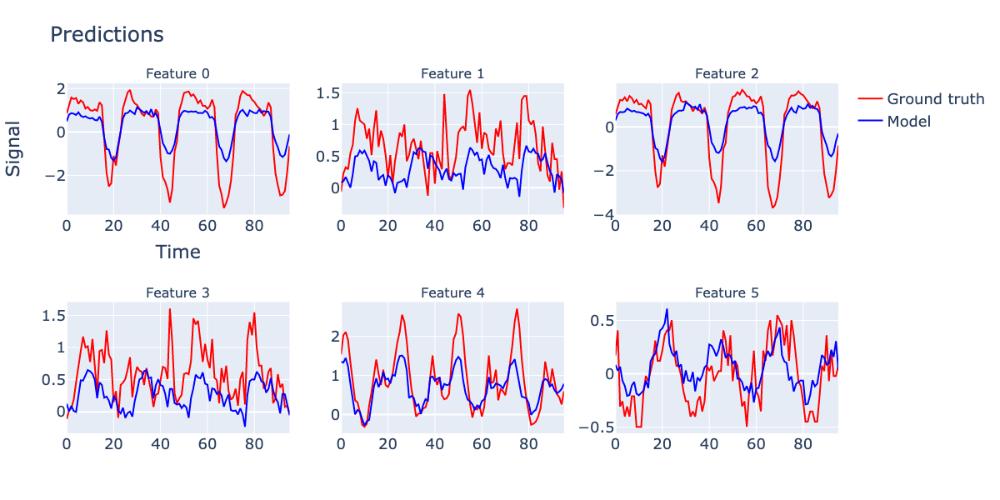
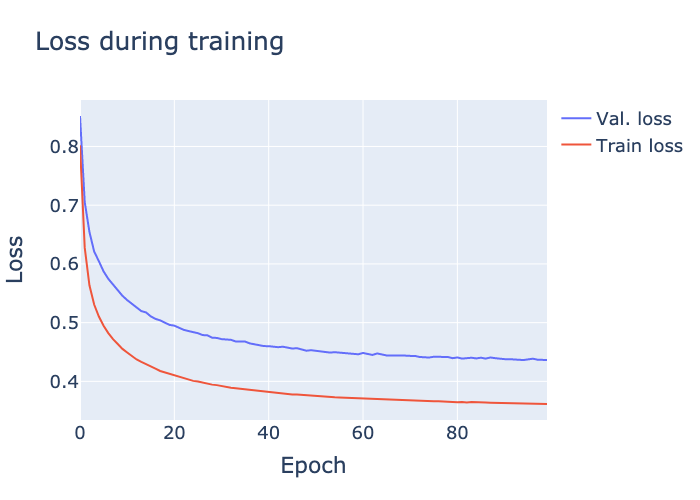

# TSMixer in PyTorch

Reimplementation of TSMixer in PyTorch.

* Original paper: [https://arxiv.org/pdf/2303.06053.pdf](https://arxiv.org/abs/2303.06053)
* Similar implementations: [https://github.com/marcopeix/time-series-analysis/blob/master/TSMixer.ipynb](https://github.com/marcopeix/time-series-analysis/blob/master/TSMixer.ipynb)

## Sample results


*Predictions on validation set*


*Loss during training*

Parameters used for example:
* `input_length`: 512
* `prediction_length`: 96
* `no_features`: 7
* `no_mixer_layers`: 4
* `dataset`: ETTh1.csv
* `batch_size`: 32
* `num_epochs`: 100 with early stopping after 5 epochs without improvement
* `learning_rate`: 0.00001
* `optimizer`: Adam
* `validation_split_holdout`: 0.2 - last 20% of the time series data is used for validation
* `dropout`: 0.3
* `feat_mixing_hidden_channels`: 256 - number of hidden channels in the feature mixing layer

## Data

You can find the raw ETDataset data [here](https://github.com/zhouhaoyi/ETDataset/tree/11ab373cf9c9f5be7698e219a5a170e1b1c8a930), specifically:

* [ETTh1.csv](https://github.com/zhouhaoyi/ETDataset/raw/11ab373cf9c9f5be7698e219a5a170e1b1c8a930/ETT-small/ETTh1.csv)
* [ETTh2.csv](https://github.com/zhouhaoyi/ETDataset/raw/11ab373cf9c9f5be7698e219a5a170e1b1c8a930/ETT-small/ETTh2.csv)
* [ETTm1.csv](https://github.com/zhouhaoyi/ETDataset/raw/11ab373cf9c9f5be7698e219a5a170e1b1c8a930/ETT-small/ETTm1.csv)
* [ETTm2.csv](https://github.com/zhouhaoyi/ETDataset/raw/11ab373cf9c9f5be7698e219a5a170e1b1c8a930/ETT-small/ETTm2.csv)

You can use the `download_etdataset.py` script to download the data:

```bash
python download_etdataset.py
```

## Running

Install the requirements:

```bash
pip install -r requirements.txt
```

Train the model:

```bash
python main.py --conf conf.etdataset.yml --command train
```

The output will be in the `output_dir` directory specified in the config file. The config file is in YAML format. The format is defined by [utils/tsmixer_conf.py](utils/tsmixer_conf.py).

Plot the loss curves:

```bash
python main.py --conf conf.etdataset.yml --command loss --show
```

Predict some of the validation data and plot it:

```bash
python main.py --conf conf.etdataset.yml --command predict --show
```

Run a grid search over the hyperparameters:

```bash
python main.py --conf conf.etdataset.gridsearch.yml --command grid-search
```

Note that the format of the config file is different for the grid search. The format is defined by [utils/tsmixer_grid_search_conf.py](utils/tsmixer_grid_search_conf.py).

### Tests

Run the tests with `pytest`:

```bash
cd tests
pytest
```

## Implementation notes from the paper

### Training parameters

> For multivariate long-term forecasting datasets, we follow the settings in recent research (Liu et al., 2022b; Zhou et al., 2022a; Nie et al., 2023). We set the input length L = 512 as suggested in Nie et al. (2023) and evaluate the results for prediction lengths of T = {96, 192, 336, 720}. We use the Adam optimization algorithm (Kingma & Ba, 2015) to minimize the mean square error (MSE) training objective, and consider MSE and mean absolute error (MAE) as the evaluation metrics. We apply reversible instance normalization (Kim et al., 2022) to ensure a fair comparison with the state-of-the-art PatchTST (Nie et al., 2023).

> For the M5 dataset, we mostly follow the data processing from Alexandrov et al. (2020). We consider the prediction length of T = 28 (same as the competition), and set the input length to L = 35. We optimize log-likelihood of negative binomial distribution as suggested by Salinas et al. (2020). We follow the competition’s protocol (Makridakis et al., 2022) to aggregate the predictions at different levels and evaluate them using the weighted root mean squared scaled error (WRMSSE). More details about the experimental setup and hyperparameter tuning can be found in Appendices C and E.

### Reversible Instance Normalization for Time Series Forecasting

Reversible instance normalization https://openreview.net/pdf?id=cGDAkQo1C0p

> First, we normalize the input data x(i) using its instance-specific mean and stan- dard deviation, which is widely accepted as instance normalization (Ulyanov et al., 2016). The mean and standard deviation are computed for every instance x(i) ∈ RTx of the input data (Fig. 2(a-3)) as

```
Mean[xi_kt] = mean_{j=1}^Tx ( xi_kj )
Var[xi_kt] = var_{j=1}^Tx ( xi_kj )
```
Where `i` = sample in the batch, `K` = num variables (features), `Tx` = num time steps in input, `Ty` = num time steps in output (prediction).

> Then, we apply the normalization to the **input data** (sent to model) as

```
xhati_kt = gamma_k * (xi_kt - Mean[xi_kt]) / sqrt(Var[xi_kt] + epsilon) + beta_k
```

where gamma_k and beta_k are learnable parameters for each variable k (**recall: K = num features**).

After final layer of model, we get output `yhati_kt`, apply the reverse transformation to the **output data** (sent to loss function) as

```
yi_kt = (yhati_kt - beta_k) * sqrt(Var[xi_kt] + epsilon) / gamma_k + Mean[xi_kt]
```

where `yhati_kt` is the output of the model for variable `k` at time `t` for sample `i`, and `yi_kt` is sent to the loss function.

### Details on multivariate time series forecasting experiments

Input = matrix X of size (L,C) where L = num time steps, C = num features
Output = prediction of size (T,C) where T = num time steps

> B.3.2 Basic TSMixer for Multivariate Time Series Forecasting
> For long-term time series forecasting (LTSF) tasks, TSMixer only uses the historical target time series X as input. A series of mixer blocks are applied to project the input data to a latent representation of size C. The final output is then projected to the prediction length T:
```
O_1 = Mix[C->C] (X)
O_k = Mix[C->C] (O_{k-1}), for k = 2,...,K
Y = TP[L->T] (O_K)
```
> where Ok is the latent representation of the k-th mixer block and Yˆ is the prediction. We project the sequence to length T after the mixer blocks as T may be quite long in LTSF tasks.

i.e. keep the number of features the same as C, and use the same input time length L in the mixture blocks, then project to longer length L for the output.

### Hidden layers of feature mixing

> To increase the model capacity, we modify the hidden layers in Feature Mixing by using W2 ∈ (H×C),W3 ∈ (C×H),b2 ∈ H,b3 ∈ C in Eq. equation B.3.1, where H is a hyper-parameter indicating the hidden size.

i.e. in th feature mixing block, where there are two fully connected layers, the first projects the number of channels from C->H and the second from H->C, where H is an additional parameter.

> Another modification is using pre-normalization (Xiong et al., 2020) instead of post-normalization in residual blocks to keep the input scale.

i.e. apply normalization to the input of the feature mixing block, instead of the output.

## Standardization of data

> Specifically, we standardize each covariate independently and do not re-scale the data when evaluating the performance. 

> Global normalization: Global normalization standardizes all variates of time series independently as a data pre-processing. The standardized data is then used for training and evaluation. It is a common setup in long-term time series forecasting experiments to prevent from the affects of different variate scales. For M5, since there is only one target time series (sales), we do not apply the global normalization.

Standardize each feature independently based on the training split, then use the same mean and standard deviation for the test set.

> We train each model with a maximum 100 epochs and do early stopping if the validation loss is not improved after 5 epochs.

Max 100 epochs, early stopping after 5 epochs without improvement.